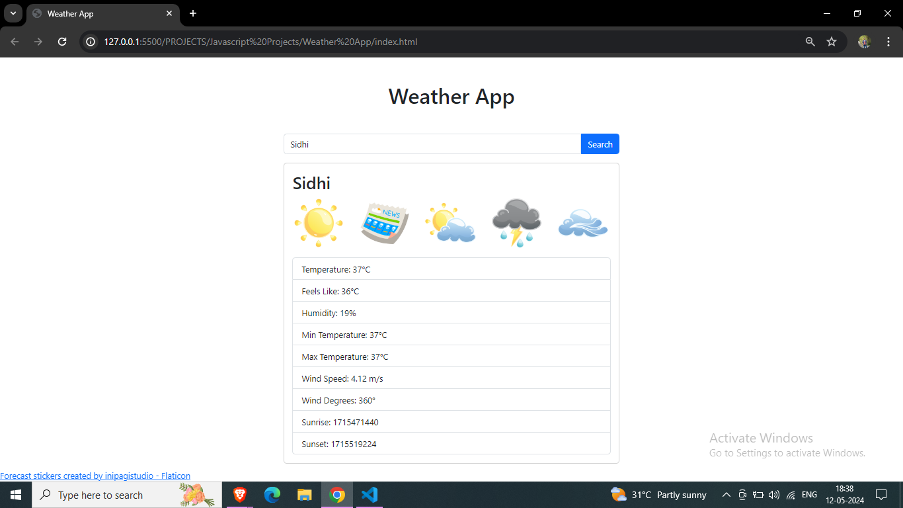

# Weather App

This is a simple weather application that allows users to check the weather conditions of various cities.

## Features

- **Search:** Users can enter the name of a city and get its current weather information.
- **Weather Information:** The application displays temperature, feels like temperature, humidity, minimum temperature, maximum temperature, wind speed, wind degrees, sunrise time, and sunset time.
- **Visual Representation:** Weather information is visually represented using icons.

## Technologies Used

- HTML
- CSS (Bootstrap)
- JavaScript

## API Used

- [RapidAPI Weather API](https://rapidapi.com/community/api/open-weather-map)

## How to Use

1. Clone the repository to your local machine.
2. Open the `index.html` file in your web browser.
3. Enter the name of a city in the input field and click on the "Search" button.
4. The weather information for the specified city will be displayed.

## Screenshots

## Credits

- Weather icons from [Flaticon](https://www.flaticon.com/free-stickers/forecast) (Forecast stickers created by inipagistudio - Flaticon).
- Weather data provided by [RapidAPI Weather API](https://rapidapi.com/community/api/open-weather-map).

## License

This project is licensed under the [MIT License](LICENSE).

